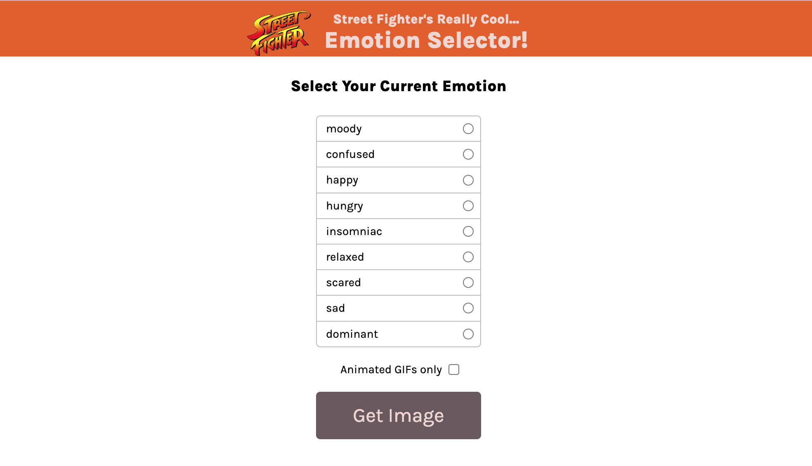

## A small project that chooses a Street Fighter character based on an emotion



This is a small project that reenforced the following:

- filter()
- radio inputs
- for of loops
- import/export
- querySelector
- getElementsByClassName
- classList.remove
- .includes()

## Running the application

Install dependencies

```bash
npm install
```

Start the local server with `vite`

```bash
npm run start
```

Preview the application in your browser.
